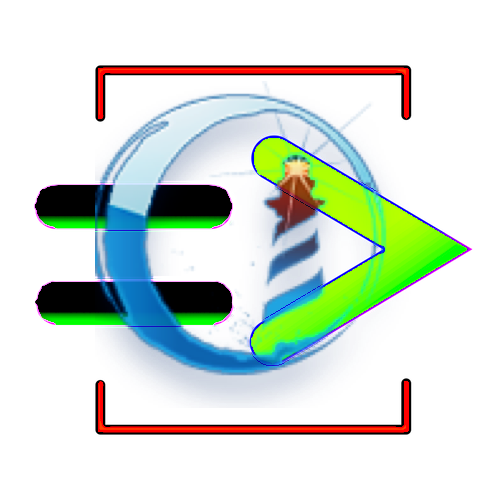

# phuck

Run [ChucK](https://chuck.stanford.edu/) inside Pharo: compile shreds, set and get globals, listen to events, drive audio. A C shim (libphuck) and uFFI bindings to run the ChucK VM, compile code, and exchange globals and events from Pharo.

**FFI bindings generated using [Pharo-CIG](https://github.com/pharo-cig/pharo-cig)**
